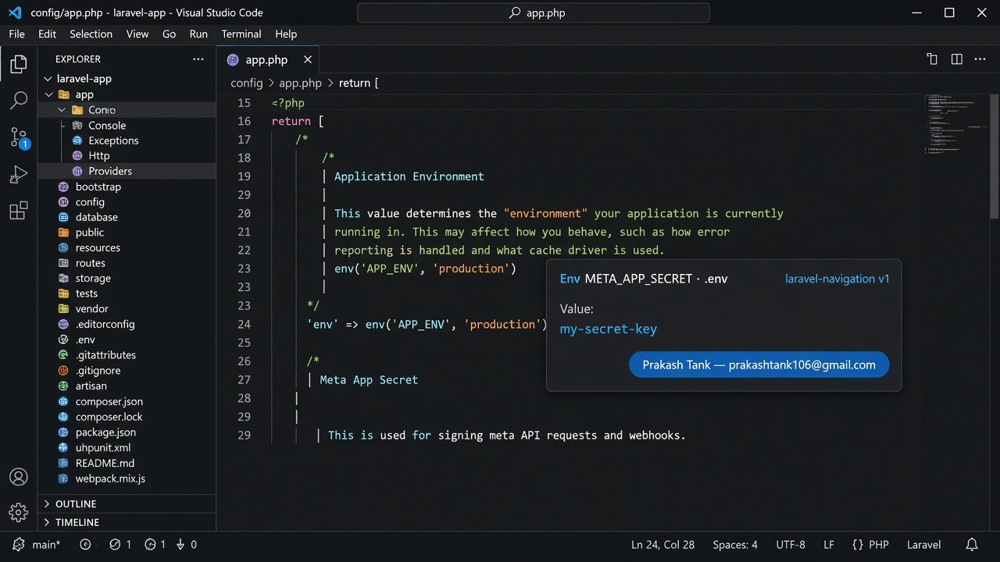
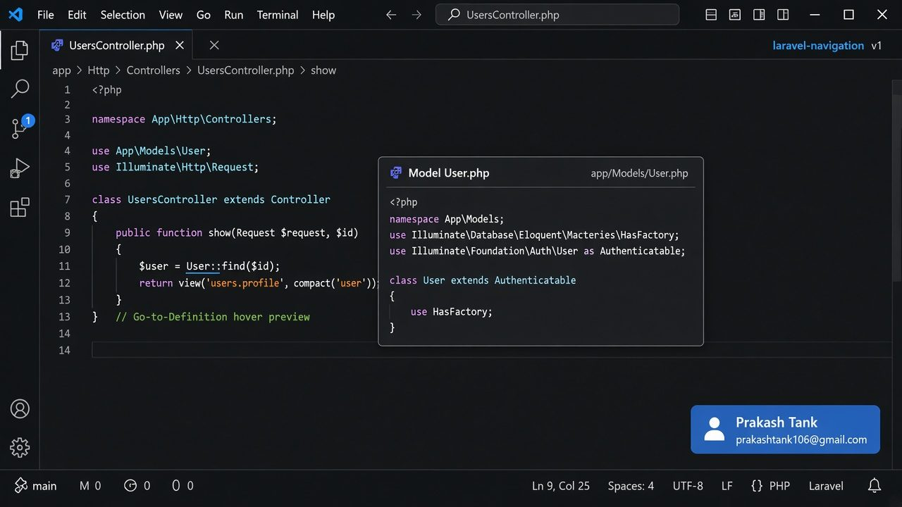
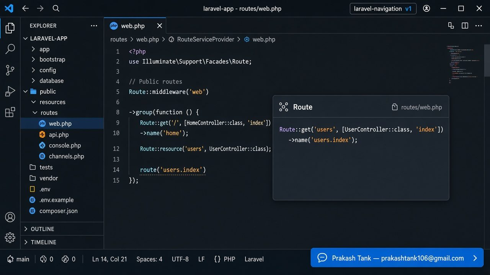

# Laravel Navigation

**Lightweight Ctrl+Hover preview + Ctrl+Click (Go to Definition) for Laravel projects in VS Code / Cursor.**

No PHP process. No Artisan. No background indexing. No file watchers.  
Work happens **only** when you hover, Ctrl+Click, or Find All References.

| | |
|---|---|
| **Version** | 1.0.0 |
| **Author** | Prakash Tank — [prakashtank106@gmail.com](mailto:prakashtank106@gmail.com) |
| **Feedback** | Hover card footer opens mail (`laravel-navigation feedback`) |
| **License** | MIT |

---

## Screenshots

Hover preview card with brand (**laravel-navigation 1.0.0**) and a feedback link:







---

## Table of contents

1. [Why this extension](#1-why-this-extension)
2. [Install](#2-install)
3. [Quick start](#3-quick-start)
4. [Hover card](#4-hover-card)
5. [Supported navigation (full list)](#5-supported-navigation-full-list)
6. [Behaviour details](#6-behaviour-details)
7. [Architecture](#7-architecture)
8. [Performance / lightweight rules](#8-performance--lightweight-rules)
9. [Limitations](#9-limitations)
10. [Develop locally](#10-develop-locally)
11. [Project structure](#11-project-structure)
12. [Troubleshooting](#12-troubleshooting)
13. [Roadmap](#13-roadmap)
14. [Marketplace listing](#marketplace-listing-vs-code-search--right-panel)

---

## 1. Why this extension

Many Laravel helpers (`view()`, `route()`, `config()`, `env()`, …) are **strings**, not PHP symbols.  
Intelephense / LSP often cannot jump to Blade, `.env`, or named routes reliably.

Heavy extensions (e.g. Laravel Extra Intellisense) boot your app via **PHP** in the background and can freeze the machine.

**laravel-navigation** solves navigation with:

- file conventions (`app/Models`, `resources/views`, `routes/`, …)
- `composer.json` + `vendor/composer/autoload_psr4.php` (for `Illuminate\…`)
- capped, cached disk reads

---

## 2. Install

### From Marketplace (recommended)

1. Open **Extensions** (`Ctrl+Shift+X` / `Cmd+Shift+X`).
2. Search **Laravel Navigation**.
3. Install **Laravel Navigation** by Prakash Tank.

Or from the command line:

```bash
code --install-extension prakashtank.laravel-navigation
# or
cursor --install-extension prakashtank.laravel-navigation
```

After install: `Ctrl+Shift+P` → **Developer: Reload Window**.

### From VSIX

```bash
cd /path/to/extension
npm install
npm run compile
npm run package
```

Then **Extensions** → `⋯` → **Install from VSIX…**, or:

```bash
cursor --install-extension laravel-navigation-1.0.0.vsix --force
# or
code --install-extension laravel-navigation-1.0.0.vsix --force
```

### From source (Extension Development Host)

```bash
npm install
npm run compile
```

Press **F5** → open a Laravel app in the new window.

### Disable conflicting heavy tools

If the IDE hangs, disable **Laravel Extra Intellisense** (it spawns PHP against your app).

Keep **PHP Intelephense** for generic PHP / vendor IntelliSense; this extension focuses on Laravel string + convention navigation.

---

## 3. Quick start

1. Open a Laravel project (folder that contains `artisan`).
2. Open a PHP or Blade file.
3. **Hover** a supported symbol → preview card.
4. **Ctrl+Click** (or F12) → jump to target file / line.
5. On a named route: **Shift+F12** → Find All References (capped scan).

---

## 4. Hover card

Each successful resolve shows a hover card:

| Area | Content |
|------|---------|
| Top-left | Kind (Model, Env, Route, …), file link, relative path |
| Top-left (env/config) | **Value:** live value from `.env` / config (and `env()` inside config) |
| Footer | Brand: **laravel-navigation 1.0.0** |
| Body | Short code preview (capped); env shows `KEY=value` |
| Bottom-right | Blue feedback button: **Prakash Tank — prakashtank106@gmail.com** |

Click the **filename** in the card → opens the target in a new editor tab at the right line.

---

## 5. Supported navigation (full list)

### 5.1 Models

| You write | Opens |
|-----------|--------|
| `User::find()`, `new User`, `User $user` | `app/Models/User.php` (fallback `app/User.php`) |
| `App\Models\User` | PSR-4 mapped file |

### 5.2 Views / Blade

| You write | Opens |
|-----------|--------|
| `view('users.profile')` | `resources/views/users/profile.blade.php` |
| `View::make('…')` | same |
| `@include('…')`, `@extends('…')`, `@component('…')`, `@each('…')` | Blade file |
| `Route::view(..., 'pages.home')` | Blade file |
| `module::users.index` | namespaced / Modules paths (best-effort) |

### 5.3 Config

| You write | Opens |
|-----------|--------|
| `config('app.name')` | `config/app.php` at nested key |
| `Config::get('services.stripe.key')` | nested key inside `config/services.php` |

**Hover:** shows resolved **Value** (literal, or value of `env('…')` inside that config line).

### 5.4 Env

| You write | Opens |
|-----------|--------|
| `env('META_APP_SECRET')` | `.env` (or `.env.local`) on that key |
| `Env::get('…')` | same |

**Hover:** shows **Value:** from `.env`.

### 5.5 Routes (named / reverse)

| You write | Opens |
|-----------|--------|
| `route('users.index')` / `{{ route('…') }}` | definition + hover **URL** (e.g. `GET /users`) |
| `to_route('…')`, `->route('…')`, `routeIs('…')`, `Route::has('…')` | same |
| `->name('users.index')` | same definition line |
| `Route::resource` / `apiResource` + `->name('admin.')` groups | expands `.index` / `.store` / … |

**Find All References (Shift+F12)** on a route name: finds usages in `routes/`, `app/`, `resources/views/` (capped).

### 5.6 Controllers

| You write | Opens |
|-----------|--------|
| `UserController` / FQCN | `app/Http/Controllers/.../UserController.php` |
| `'UserController@index'` | controller + **method line** |
| `[UserController::class, 'index']` | controller + **method line** |

### 5.7 Classes, services, traits, Illuminate

| You write | Opens |
|-----------|--------|
| `MetaWebhookService` (type-hint / `use`) | PSR-4 / `app/Services/…` |
| `SomeTrait` / `use SomeTrait` | Traits / PSR-4 |
| `Illuminate\Http\Request`, Facades, etc. | `vendor/laravel/framework/...` via Composer autoload |

### 5.8 Laravel conventions

| Kind | Example | Folder |
|------|---------|--------|
| Middleware | `Authenticate` or alias `auth` | `app/Http/Middleware` (+ Kernel / `bootstrap/app.php` aliases) |
| Job | `SendEmailJob` | `app/Jobs` |
| Event | `OrderShipped` | `app/Events` |
| Listener | `SendShipmentNotification` | `app/Listeners` |
| Policy | `PostPolicy` | `app/Policies` |
| Form Request | `StoreRuleRequest` | `app/Http/Requests` |

### 5.9 Methods on `$this` / typed variables

| You write | Opens |
|-----------|--------|
| `$this->filters()` | `function filters` in **same class** (or parent `extends`, 1 level) |
| `self::foo()` / `static::bar()` | same |
| `$request->keywordsList()` when `StoreRuleRequest $request` | method on that class |

### 5.10 Eloquent relations

| You write | Opens |
|-----------|--------|
| `$user->posts` / `$user->posts()` when `$user` is typed as a Model | Related model (e.g. `Post`) by reading `posts()` body for `hasMany(Post::class)` etc. |
| If related class not found | Falls back to the relation **method** on the owner model |

Supported relation helpers (parsed):  
`belongsTo`, `belongsToMany`, `hasOne`, `hasMany`, `hasManyThrough`, `hasOneThrough`, `morphTo`, `morphOne`, `morphMany`, `morphToMany`, `morphedByMany`, …

### 5.11 Assets, Vite, translations

| You write | Opens |
|-----------|--------|
| `asset('js/app.js')` / `secure_asset('…')` | `public/js/app.js` (fallbacks: `public/build/…`, `resources/…`) |
| `@vite('resources/js/app.js')` | that path under project root |
| `@vite([..., 'resources/css/app.css'])` | hover the string → that entry file |
| `__('messages.welcome')` / `trans()` / `@lang()` / `Lang::get()` | `lang/{locale}/messages.php` or `resources/lang/...` |
| JSON lang `__('Hello')` | `lang/en.json` (best-effort) |

Locale is taken from `config('app.locale')` / `fallback_locale` when readable; otherwise `en`.

---

## 6. Behaviour details

### Laravel root detection

Walks up from the current file (max depth 12) looking for:

1. `artisan`, or  
2. `composer.json` + `app/` + `config/`

Result is cached per directory.

### `use` import expansion

Short names like `MetaWebhookService` are expanded via top-of-file `use App\Services\MetaWebhookService;` (first ~120 lines) before path resolve.

### Env / config values

- `.env` parsed with size cap; comments / quotes handled simply.
- Config nested keys use bracket-scope walking so `services.stripe.key` does not match the wrong `'key'`.
- If config value is `env('X')` or `env('X', 'default')`, hover shows the `.env` value (or default).

### Route index

Scans `routes/**/*.php` (max 40 files), indexes `->name('…')`, group `name`/`prefix`, and `Route::resource` / `apiResource` actions; caches by file mtimes.

---

## 7. Architecture

```
VS Code / Cursor
   │  Hover / Ctrl+Click / Find References
   ▼
extension.ts
   ├── DefinitionProvider
   ├── HoverProvider        (preview + value + feedback button)
   └── ReferenceProvider    (named routes only)
            │
            ▼
   detect/symbolDetector.ts   → kind + value (+ member)
            │
            ▼
   resolve/resolveSymbol.ts   → Location (+ displayValue)
            │
            ├── resolvers/*   (view, config, env, route, class, …)
            ├── laravel/psr4.ts, routeIndex.ts, project.ts
            └── utils/*       (cache, preview, fileFinder, phpHelpers)
```

**Principle:** detect cheaply on the current line → resolve with convention paths → only then optional capped reads.

---

## 8. Performance / lightweight rules

| Rule | Detail |
|------|--------|
| Idle | No work (no watchers, no indexers, no PHP) |
| Trigger | Only hover / definition / references |
| No PHP spawn | Never runs `php`, `artisan`, or Composer CLI |
| Caches | LRU for locations, roots, `.env`, routes, PSR-4, previews |
| Caps | `.env` ≤ 256KB; config ≤ 128KB; route files ≤ 40; reference scan ≤ ~80 files; preview ≤ 8KB / 35 lines; controller walk ≤ 40 dirs / 200 files |

If the machine still hangs, check other extensions (Extra Intellisense, SonarLint) — not this one’s idle path.

---

## 9. Limitations

- **Not a full PHP language server** — complex type inference, generics, macros: use Intelephense.
- **`$obj->method()`** only when `$obj` type is clear nearby (param hint / `@var` / `new`).
- **Relations** need a real `function posts()` body with `*Many(*::class)` etc.; magic attributes without methods may miss.
- **Config values** that are multi-line arrays / complex expressions may not display a simple Value.
- **Vendor** resolve depends on `vendor/` being installed (`composer install`).
- **Find References** is only for **named routes** (not every symbol).
- **Env / config hover** shows the live value from `.env` / config. Treat that as local-only; do not share screenshots that include secrets.

---

## 10. Develop locally

```bash
npm install
npm run compile    # tsc → out/
npm run watch      # optional
npm run package    # → laravel-navigation-1.0.0.vsix
```

Debug: **F5** (launch config in `.vscode/launch.json`).

Requirements: Node 18+, VS Code / Cursor engines `^1.80.0`.

---

## 11. Project structure

```
extension/
├── package.json
├── tsconfig.json
├── README.md                 ← this file
├── LICENSE
├── src/
│   ├── extension.ts          # activate providers + commands
│   ├── detect/
│   │   └── symbolDetector.ts
│   ├── resolve/
│   │   └── resolveSymbol.ts
│   ├── providers/
│   │   ├── definitionProvider.ts
│   │   ├── hoverProvider.ts
│   │   └── referenceProvider.ts
│   ├── resolvers/
│   │   ├── modelResolver.ts
│   │   ├── viewResolver.ts
│   │   ├── configResolver.ts
│   │   ├── envResolver.ts
│   │   ├── routeResolver.ts
│   │   ├── controllerResolver.ts
│   │   ├── classResolver.ts
│   │   ├── localMethodResolver.ts
│   │   ├── relationResolver.ts
│   │   └── assetLangResolver.ts
│   ├── laravel/
│   │   ├── project.ts        # find artisan root
│   │   ├── paths.ts
│   │   ├── psr4.ts           # app + vendor Illuminate
│   │   └── routeIndex.ts
│   └── utils/
│       ├── cache.ts          # LRU
│       ├── fileFinder.ts
│       ├── phpHelpers.ts
│       └── preview.ts
└── out/                      # compiled JS
```

---

## 12. Troubleshooting

| Problem | What to try |
|---------|-------------|
| Nothing on hover | Confirm extension enabled; file language is `php` or `blade`; Reload Window |
| Env value missing | `.env` exists at Laravel root; key spelling matches |
| Illuminate classes miss | Run `composer install`; check `vendor/laravel/framework` |
| Wrong jump | Check `use` import / FQCN; nested modules may need path conventions |
| High CPU | Disable Laravel Extra Intellisense; this extension does not spawn PHP |
| Old behaviour | Reinstall VSIX with `--force` and Reload Window |

---

## 13. Roadmap

Possible later (still lightweight):

- More Blade directives (`@push`, `@error`, …)
- Livewire / Volt component jump
- Policy method ↔ model ability mapping
- Optional mask for secret env values in hover

---

## Marketplace listing (VS Code search / right panel)

| What you see in search / details | Where it comes from |
|----------------------------------|---------------------|
| Icon | `images/icon.png` + `package.json` → `"icon"` |
| Title | `"displayName"` |
| Short line under the title | `"description"` |
| Publisher | `"publisher"` (Marketplace account ID) |
| Full docs on the right | **`README.md`** |
| Changelog tab | `CHANGELOG.md` |
| License | `LICENSE` |

Publish steps: see [`docs/PUBLISH.md`](docs/PUBLISH.md).
